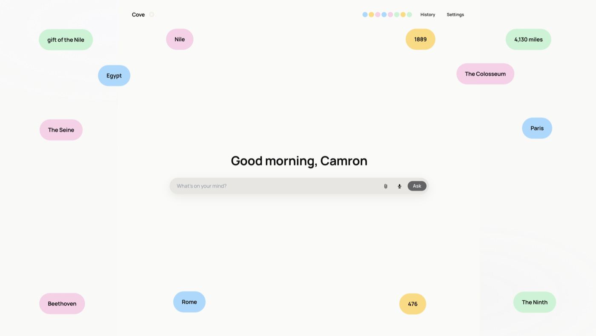
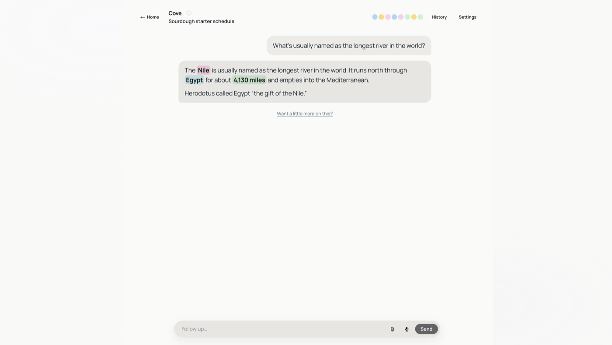
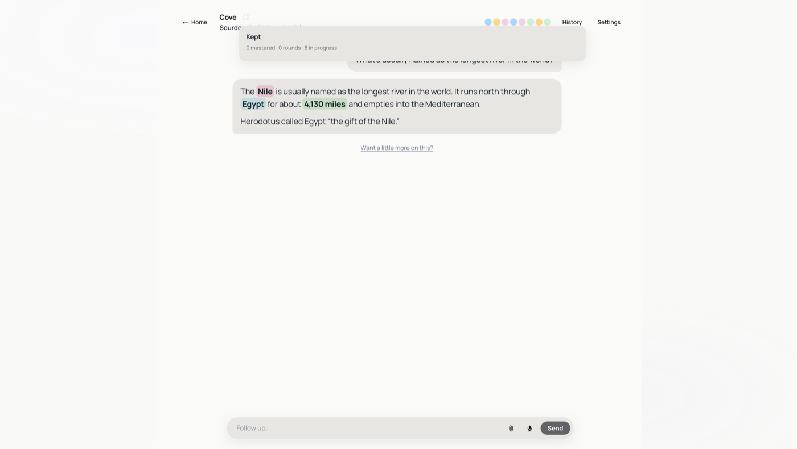

# Halo + VocalLearn

**Halo** is a live, invite-only web product that real people use today. I own it end to end — TypeScript/React UI, APIs, Postgres, auth, production deploys, and the patches I ship after family and early-access testers start depending on it.

**VocalLearn** is the related iPhone lab in the same repo: a voice-first spaced-repetition tutor I built and run on a physical device.

This is the project I want hiring teams to open first.


---

## Quick links

| | |
| --- | --- |
| **Live product** | [halo-gules-three.vercel.app](https://halo-gules-three.vercel.app) — Paper Ask + Cove/Keep loop (invite-only) |
| **UI preview (no login)** | [halo-gules-three.vercel.app/preview](https://halo-gules-three.vercel.app/preview) — Lab mixer + walkable loop demo |
| **Code** | [`web/`](./web/) (Halo) · [`app/`](./app/) (VocalLearn iOS) |
| **Stack** | TypeScript, React, Next.js, React Native, PostgreSQL, Supabase, Vercel, xAI/Grok |
| **Recruiter summary** | [`docs/FOR_RECRUITERS.md`](./docs/FOR_RECRUITERS.md) |

Halo is **invite-only** (no public signup). I provision accounts, watch what breaks, and push production updates.

**Current release:** v1.1 (August 2026) — Cove/Keep learning loop shipped to early-access production, not just Lab.

---

## The idea

Most AI chat apps are write-only — you ask, you read, you forget. Halo starts as a beautiful private Ask (like a family Grok), then grows into something that helps you **actually remember** what you learned.

**Positioning:** Duolingo-side of Quizlet, not a video game. Ask stays the front door. The learning layer is optional juice on top of real answers — a daily tidy for people who want it, not a separate study app bolted on.

**Gamification level:** about 5 out of 10. Light collection, mastery rings, a clear-the-day moment — still obviously a learning tool, not an RPG. No HP, maps, or combat chrome.

## Screenshots

| Home (due chips) | Harvest in chat | Keep panel |
| --- | --- | --- |
|  |  |  |

No-login demo: [halo-gules-three.vercel.app/preview](https://halo-gules-three.vercel.app/preview) → Mix → Loop.

---

## What's live today

| Surface | URL | What you get |
| --- | --- | --- |
| **Production** | `/ask` (login) | Full product: Ask + harvest + Keep + due Home + review rounds |
| **Lab preview** | `/preview` (no login) | Mixer, dummy data, visual QA harness — same loop, no account |
| **Native** | VocalLearn iOS | Voice-first tutor prototype (separate app in `app/`) |

Early-access and family users run v1.1 on the live site after invite onboarding. `/preview` is my sandbox for tuning motion and harvest before the next promote.

---

## Halo web — the product

### Ask (front door)

A private AI search and chat that feels clean and fast on phone and desktop.

- Streaming Grok replies with conversation history
- Recent-topic bubbles on Home; composer morphs into chat
- Dictation, thinking status, optional Sources when the model is confident
- Paper visual system (flat pastel) on production; liquid-glass “Ours” skin tunable in Lab
- Per-user daily message cap and cost-aware model routing
- Invite-only auth, Supabase Postgres, row-level security

### Cove / Keep loop (learning layer)

Turn a great answer into facts you bank, review when due, and graduate when mastered. **Shipped in v1.1 on production `/ask`.**

#### Three seats (where facts live)

| Seat | Meaning | What the user sees |
| --- | --- | --- |
| **Keep** | Not due — banked for later | Header beads, one per fact, cap 30 |
| **Home** | Due — ready to review today | Field of chips to clear (up to 16 seats) |
| **Mastered** | Done — graduated | Count in the header shelf (◎), off the daily field |

Facts harvested from an Ask land in **Keep**, not on Home. They only appear on Home when the scheduler marks them due. The whole library never floods the field at once.

#### The daily loop

```
  Ask a question
       ↓
  Harvest — key spans light up in the answer (who / where / when / meaning)
       ↓
  Keep — facts fly into header beads; same Ask stays a cluster
       ↓
  Due — scheduler drops a cluster onto Home as chips
       ↓
  Clear — tap a chip; review its cluster (SEE all, then SAY all)
       ↓
  Ok → bead flies back to Keep with a mastery mark (bronze → silver → gold)
  Miss → stays due; round continues
       ↓
  Mastered — three successful clears → fact leaves the daily row
       ↓
  You're clear — Home empty, Keep calm, quiet celebration
```

**Fact kinds** — color means type, not mood:

| Kind | Color role | Typical facts |
| --- | --- | --- |
| **who** | names, people | "Herodotus", "the pharaoh" |
| **where** | places | "Egypt", "the Mediterranean" |
| **when** | dates, durations | "4,130 miles", "1863" |
| **meaning** | definitions | "the gift of the Nile" |

Related facts from the same Ask **clump** on Home. Tap one chip to play the whole cluster.

**Mastery shelf** — Keep beads sort gold → silver → bronze → new (left to right). Rank shows as a metal ring on the kind color — not gray bands, not bigger beads.

### Engineering highlights

Concrete work a reviewer can grep for:

| Area | Files / notes |
| --- | --- |
| **Loop state** | `web/src/lib/keep-memory.ts` — beads, clears, mastery, clusters; syncs to Supabase |
| **Harvest** | `web/src/lib/learn-mine.ts`, `harvest-policy.ts` — miner extracts closed facts from replies |
| **Motion** | `web/src/components/HarvestFlights.tsx` — facts animate from chat into Keep |
| **Chat API** | `web/src/app/api/chat/route.ts` — streaming Grok, routing, caps |
| **Tests** | `npm run test:harvest` — fixture suites for harvest gates and miner output |
| **Deploy** | Vercel; Lab preview deploy vs production promote workflow |

---

## Lab preview (`/preview`)

No login required — good for recruiters and for visual QA without an account.

**Try the loop:** open `/preview` → left rail **Mix → Loop** → Reset, Demo pack, Due now, Bank, Clear, Miss, Master.

The mixer also exposes Paper vs Ours skins, harvest tuning, and film capture for regression checks. Production `/ask` uses Paper and real user data; `/preview` is the tuning bench.

---

## VocalLearn — iPhone lab (native)

Voice-first spaced repetition, separate from the Halo web product but sharing Supabase and Grok. This is where I prototyped core learning mechanics that the web Cove loop adapts.

**Loop:** lesson → teach → spoken recall → AI scores meaning (not exact wording) → SM-2 schedules the next review.

**What's built**

- React Native + Expo app shipped to a physical iPhone
- On-device speech-to-text and text-to-speech
- Modified SM-2 review engine with per-fact strictness
- Teaching plans with inferred lesson frames and per-fact copy
- Hint ladder on misses: hint 1 → hint 2 → reveal → forced repeat
- Supabase auth, Postgres, and row-level security

Active product work is on Halo web. VocalLearn native is the research lab for voice-first learning.

---

## Stack

| Layer | Technology |
| --- | --- |
| **Web UI** | React 19, Next.js 16, TypeScript, Tailwind CSS, Framer Motion |
| **Mobile** | React Native, Expo SDK 54, Expo Router, Zustand |
| **Data** | PostgreSQL, Supabase (auth, RLS, migrations in `supabase/`) |
| **AI** | xAI Grok (streaming chat, harvest miner, semantic scoring) |
| **Ship** | Git, Vercel (web), Xcode archive (iOS) |

---

## Repo map

```text
web/              Halo — Next.js production web app (start here)
  src/app/        Routes: /ask, /preview, /login, /invite
  src/components/ UI: harvest, Keep, Home, chat, play sheet
  src/lib/        Grok client, Keep memory, harvest scoring
app/              VocalLearn — Expo Router screens
src/engine/       Spaced repetition, teaching plans, tutor logic
src/hooks/        Session orchestration
supabase/         Schema migrations
docs/             Product vision, pricing, recruiter notes
inbox/            Internal planning notes (not user-facing)
```

---

## Roadmap (honest)

| Near term | Goal |
| --- | --- |
| **1.1.1** | Calendar-day due, timezone fixes, Saves (recipes/lists) |
| **1.2** | Intent-aware harvest, Luna routing, light onboarding tour |
| **1.3+** | Streaks, achievements, iOS shell, pricing |

Parked until product fit: public signup, ads, full RPG gamification, realtime voice.

Details: [`web/ROADMAP-VERSIONS.md`](./web/ROADMAP-VERSIONS.md) · [`docs/HALO_PRICING_AND_SCALING.md`](./docs/HALO_PRICING_AND_SCALING.md)

---

## For developers

- [`web/README.md`](./web/README.md) — local run, env vars, deploy commands
- [`HANDOFF.md`](./HANDOFF.md) — VocalLearn native engineering state
- [`docs/ENGINEERING_README.md`](./docs/ENGINEERING_README.md) — deeper technical notes

## For recruiters

- [`docs/FOR_RECRUITERS.md`](./docs/FOR_RECRUITERS.md) — 60-second summary, what to click, honest constraints
- [`docs/GITHUB_SETUP.md`](./docs/GITHUB_SETUP.md) — one-time repo polish checklist (description, topics, default branch)
